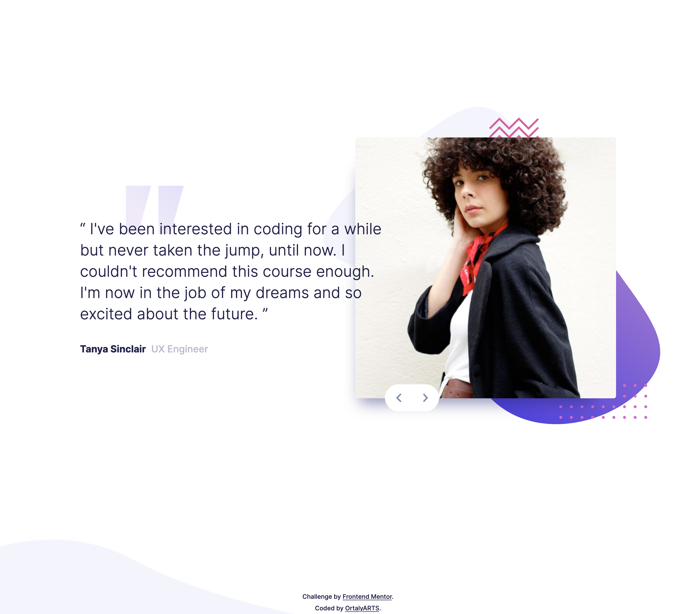

# Frontend Mentor - Coding bootcamp testimonials slider solution

This is a solution to the [Coding bootcamp testimonials slider challenge on Frontend Mentor](https://www.frontendmentor.io/challenges/coding-bootcamp-testimonials-slider-4FNyLA8JL). Frontend Mentor challenges help you improve your coding skills by building realistic projects. 

## Table of contents

- [Overview](#overview)
  - [The challenge](#the-challenge)
  - [Screenshot](#screenshot)
  - [Links](#links)
- [My process](#my-process)
  - [Built with](#built-with)
  - [Useful resources](#useful-resources)
- [Author](#author)

## Overview

### The challenge

Users should be able to:

- View the optimal layout for the component depending on their device's screen size
- Navigate the slider using either their mouse/trackpad or keyboard

### Screenshot

### Links

- Solution URL: [Github code](https://github.com/ortalyarts/frontendmentor-coding-bootcamp-testimonials-slider)
- Live Site URL: [Preview](https://frontendmentor-coding-bootcamp-testimonials-slider-seven.vercel.app/)

## My process

### Built with

- Semantic HTML5 markup
- CSS custom properties
- Flexbox
- CSS Grid
- Blockquote element
- Mobile-first workflow
- Vanilla JS
- CSS @keyframes for animtating the slides appeareance
- @media (prefers-reduced-motion) - accessibilty

### Useful resources

- [Simple Carousel](https://webdesign.tutsplus.com/how-to-build-a-simple-carousel-with-vanilla-javascript--cms-41734t) - I used it as a base for my carousel - How To Build a Simple Carousel With Vanilla JavaScript.
- [Accessible Carousel](https://www.smashingmagazine.com/2023/02/guide-building-accessible-carousels/) - tjeoretical tutorial about accessibility issues in sliders.
- [Fluid typography](https://www.smashingmagazine.com/2022/01/modern-fluid-typography-css-clamp/) - CSS clamp for font-size

## Author

- OrtalyARTS Portfolio Website - [@ortalyARTS.com](https://ortaly.com/)
- Frontend Mentor - [@ortalyARTS](https://www.frontendmentor.io/profile/ortalyARTS)
- Linkedin - [@ortalyARTS](www.linkedin.com/in/ortalyarts) 

